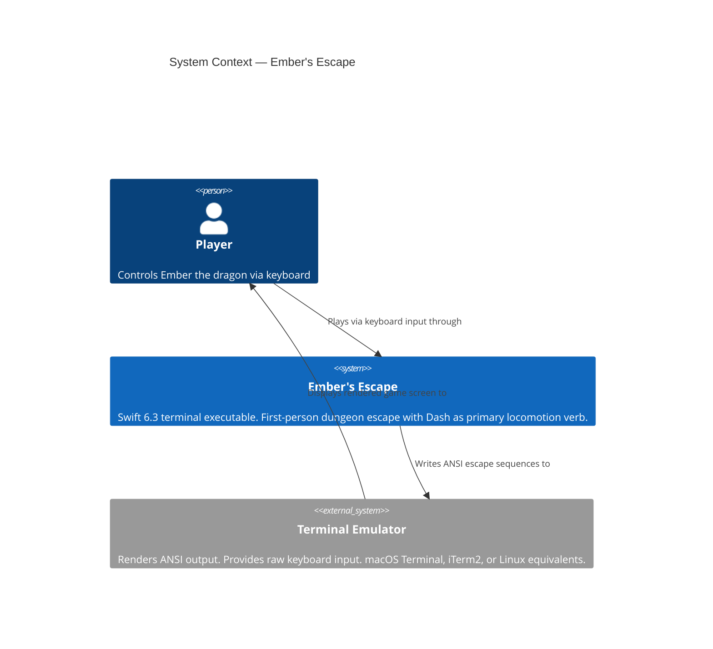
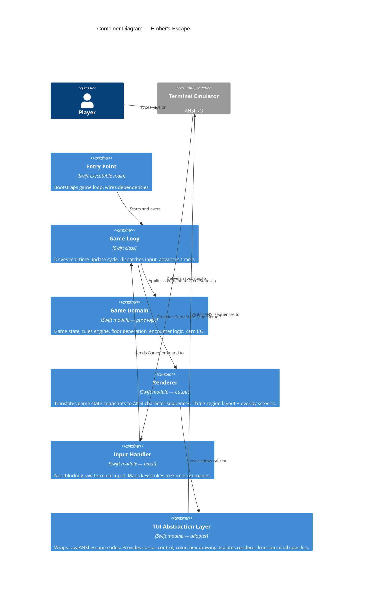
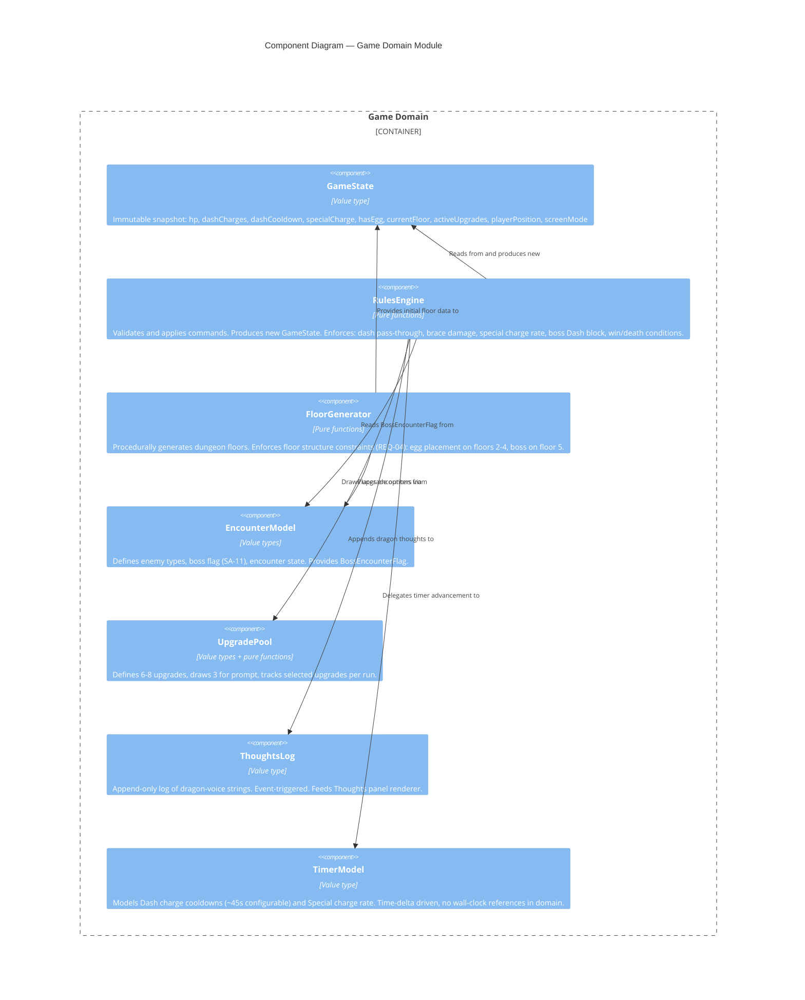
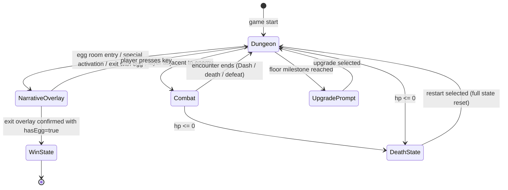

# Architecture Design — Ember's Escape (dcjam2026-core)
**Feature**: dcjam2026-core
**Date**: 2026-04-02
**Author**: Morgan (Solution Architect — DESIGN wave)
**Status**: Confirmed

---

## 1. System Context

Ember's Escape is a single-player terminal game running as a native macOS/Linux command-line executable. There are no external services, no network calls, and no persistent storage beyond a single in-process run. The system boundary is the process itself.



**External integration note**: No third-party APIs. No contract tests required.

---

## 2. Container Diagram

Ember's Escape is a single process. The "containers" are logical execution units within that process.



---

## 3. Component Diagram — Game Domain (L3)

The Game Domain module has enough internal complexity (5+ distinct responsibilities) to warrant a Component diagram.



---

## 4. Screen Mode State Machine

The game has five distinct screen modes. Transitions are part of the domain, not the renderer.



**ScreenMode** is a domain value. The renderer reads it to select which rendering strategy to apply. This keeps the overlay (egg discovery, special, exit patio) logic in the domain where it is testable.

---

## 5. Real-Time Game Loop Architecture

### Loop Structure

The game loop runs on the main thread as a tight `while` loop. The loop is entirely synchronous — no `async/await`, no `@MainActor`, no Swift concurrency primitives required in the hot path.

```
while gameState.screenMode != .winState {
    let deltaTime = clock.tick()          // wall-clock delta since last tick
    let input = inputHandler.poll()       // non-blocking; returns nil if no key pressed
    let command = input.map(inputMapper.map)
    gameState = rulesEngine.apply(command, to: gameState, deltaTime: deltaTime)
    renderer.render(gameState)
}
```

Key properties:
- **Target tick rate**: 30 Hz (33 ms tick). Sufficient for a terminal game; input lag imperceptible.
- **Non-blocking input**: raw terminal mode, `read()` with `O_NONBLOCK` or select/poll. Input handler returns `Optional<GameCommand>`.
- **Timer advancement**: every tick, `deltaTime` is passed to `TimerModel.advance(delta:)` which updates cooldown states. No `Timer`, `DispatchQueue`, or `Task` for cooldowns — deterministic, testable.
- **No async/await in the core loop**: the loop is synchronous by design. A synchronous blocking loop does not require `@MainActor` or any Swift concurrency primitives — there is no concurrent access to guard against. Swift concurrency is relevant only if future audio/async I/O is added.

### Timing for Dash Cooldowns

`TimerModel` holds per-charge countdown values (e.g., `[0.0, 32.4]` seconds remaining). Each tick subtracts `deltaTime`. When a countdown reaches 0, the charge is restored. This is testable: inject a mock clock, advance time, assert charge restoration.

### Special Charge Rate

`specialCharge` accumulates at a configurable rate per second (e.g., 0.01 per second for a ~100s full charge). The rate must be calibrated so the first encounter on Floor 1 — reachable in under 20 seconds of typical play — cannot yield a full charge. The rate is a named constant in `GameConfig`, not hardcoded.

---

## 6. First-Person Dungeon Rendering — Approach

See ADR-003 for the decision. The chosen approach is **pre-computed depth-zone rendering** (not ray-casting).

### Rationale

Ray-casting (Wolfenstein-style) computes column-by-column wall distances at render time. It is accurate but computationally unbounded — overkill for a jam, and more importantly, produces a floating-point rendering model that does not map naturally to fixed-character terminal cells.

Pre-computed depth zones use a **lookup table** of ASCII art frames indexed by `(direction, wallDistance, openLeft, openRight)`. The dungeon grid is queried for the 5 cells directly ahead (and one cell each side), and the matching pre-drawn frame is emitted.

### Depth Zones

```
Zone 1 (1 cell ahead):  Large walls fill most of the viewport — claustrophobic
Zone 2 (2 cells ahead): Medium walls with corridor sides visible
Zone 3 (3 cells ahead): Small walls — open corridor ahead
Zone 4 (4+ cells ahead): Vanishing point / open space
Left turn visible:       Left passage opens at zone 2+
Right turn visible:      Right passage opens at zone 2+
```

### Benefits for a 4-Day Jam

- No floating-point math per render call
- Frames are ASCII strings — easy to author, easy to test (snapshot the output)
- Predictable: given a known grid state, the renderer always produces the same output
- Fits the "pre-computed texture" mental model well-understood by the developer

### Viewport Area

The first-person view occupies the upper portion of the terminal (roughly 60-70% of height). The exact ASCII art dimensions are design details for the crafter, constrained by the terminal width assumption (80 columns minimum).

---

## 7. TUI Architecture

See ADR-001 for the library decision. The chosen approach is **raw ANSI escape codes via a thin custom TUI abstraction layer**.

The TUI Abstraction Layer is the adapter boundary. It exposes:

- `clearScreen()` — `\033[2J\033[H`
- `moveCursor(row:col:)` — `\033[{row};{col}H`
- `setColor(fg:bg:)` — `\033[{code}m`
- `resetColor()` — `\033[0m`
- `hideCursor()` / `showCursor()`
- `print(at:row:col:)` — combined move + write
- `drawBox(x:y:width:height:)` — box-drawing characters (U+250x range)
- `rawMode(enable:)` — `tcsetattr` to set/restore terminal mode

The Renderer module calls only these abstractions. It has zero direct ANSI string knowledge. This means:
1. The renderer is testable with a mock TUI layer that captures draw calls as strings
2. If a library is adopted later, only the TUI layer adapter changes

### Non-Blocking Input

Raw terminal mode (`tcsetattr` removing `ICANON` and `ECHO`) enables byte-at-a-time input. A `fcntl` call sets `O_NONBLOCK` on `STDIN_FILENO`. The `InputHandler.poll()` call attempts a `read()` and returns `nil` on `EAGAIN`.

---

## 8. Paradigm — CONFIRMED

**Confirmed by developer**: 2026-04-02

### Decision: Value-Oriented OOP

- `GameState`, `FloorMap`, `EncounterModel`, `TimerModel` — all `struct` (value types, copy-on-write, immutable snapshots)
- `RulesEngine` — namespace of pure static functions (or enum with static methods). No stored state.
- `FloorGenerator` — pure functions; procedural generation is inherently functional
- `Renderer` — `struct` or `class` with pure `render(state:)` method; no mutable state of its own
- `GameLoop` — plain `class` (or `struct` with `mutating` run loop); the single reference-type hub that owns the mutable loop state. No `@MainActor` annotation required — the loop is synchronous and blocking, so there is no concurrent access to guard against.
- Ports defined as `protocol` (e.g., `TUIOutputPort`, `InputPort`) — Swift protocols are first-class

### Developer Rationale (recorded verbatim)

> "If the game loop is truly synchronous, you might not need any actors or async/await functions. Meaning you don't need to guard things with `@MainActor`."

A synchronous 30 Hz game loop (tick-driven, blocking) occupies the calling thread exclusively. There is no second thread or concurrent task that could race on game state. `@MainActor` is a concurrency isolation mechanism — it is appropriate when code runs on the main actor queue alongside other asynchronous work. For a pure synchronous loop, it is an overcorrection that adds annotation noise without safety benefit.

**Why not "pure FP"?**
Swift's I/O boundaries (terminal, `tcsetattr`) are imperative. A pure FP effect system adds boilerplate that does not pay for itself in a 4-day jam. Value-oriented OOP achieves 90% of the testability benefit without fighting the language.

**Why not classical OOP?**
Mutable `Enemy`, `Player` objects communicating via method calls create hidden state dependencies that are painful to test and debug in a real-time loop. The domain should be a pure transformation, not a web of collaborating objects.

---

## 9. Component Architecture — Module Boundaries

See `component-boundaries.md` for full detail.

| Module | Responsibility | Dependencies |
|--------|---------------|-------------|
| `GameDomain` | Pure game logic — state, rules, generation | None (no imports from other modules) |
| `TUILayer` | Raw ANSI adapter — cursor, color, box-drawing, raw mode | OS: `Darwin.POSIX` / `Glibc` |
| `InputHandler` | Non-blocking raw keyboard input → `GameCommand` | `TUILayer` (for raw mode setup) |
| `Renderer` | `GameState` → draw calls via `TUIOutputPort` | `GameDomain` (read-only), `TUILayer` (via port) |
| `GameLoop` | Tick driver, wires all modules, owns run loop | All modules |
| `EntryPoint` | Bootstrap, dependency wiring | `GameLoop` |

**Dependency rule**: `GameDomain` has zero imports from any other module. All other modules may import `GameDomain`. The `TUILayer` and `InputHandler` are infrastructure — only `GameLoop` and `Renderer` depend on them directly.

---

## 10. Quality Attribute Strategies

### Testability (Primary — solo dev, 4 days)
- Pure domain functions → unit testable without any I/O setup
- `TUIOutputPort` protocol → mock renderer captures draw calls as string arrays → snapshot testable
- `InputPort` protocol → inject scripted command sequences → deterministic game loop testing
- `TimerModel` with injected delta-time → cooldown logic testable without wall-clock

### Maintainability
- Modular boundaries with Swift access control (`internal` by default; `public` only at module API surface)
- ScreenMode state machine is explicit and exhaustive — no "magic flag" combinations
- GameConfig struct holds all tunable constants (cooldown rate, special charge rate, floor counts)

### Performance
- 30 Hz terminal render loop is well within Swift's single-threaded throughput for string output
- Pre-computed depth zones eliminate per-frame raycast computation
- Full-screen redraw every tick is standard for terminal games; ANSI clear + redraw is fast enough at 80x24

### Portability (macOS + Linux)
- TUILayer isolates Darwin/Glibc differences behind `#if os(macOS)` / `#if os(Linux)` in one file
- No macOS-specific frameworks (no AppKit, no Foundation beyond `Date`/`Clock` if needed)
- Swift Package Manager targets both platforms natively

---

## 11. Architecture Enforcement

**Style**: Ports and Adapters (Hexagonal) — applied within a single-process modular structure

**Language**: Swift 6.3

**Recommended tool**: There is no mature Swift-native equivalent to ArchUnit. Enforcement relies on:
1. **Swift access control**: `GameDomain` module exposes only `public` types; internal implementation hidden. Cross-module import violations are compiler errors.
2. **Swift Package Manager module boundaries**: separate `Target` per module in `Package.swift` enforces import graph at build time. Any forbidden import becomes a build failure.
3. **Architecture tests** (recommended, optional for jam): a `GameDomainArchTests` test target that attempts to import infrastructure types and verifies the build fails. Alternatively, a CI script that runs `swift package show-dependencies` and asserts the dependency graph.

**Rules to enforce**:
- `GameDomain` target has no dependency on `TUILayer`, `InputHandler`, or `Renderer` targets
- `Renderer` depends on `GameDomain` (read) and `TUILayer` (via protocol), not on `InputHandler`
- `InputHandler` depends on `TUILayer` only
- `GameLoop` is the only target that imports all other targets
- Circular dependencies between targets: zero (enforced by SwiftPM build graph)

---

## 12. Deployment Architecture

Single Swift executable. Built with `swift build -c release`. Runs as:
```
./DCJam2026
```

No installation required beyond the binary. Terminal must support ANSI escape sequences (all modern macOS/Linux terminals do). Minimum terminal size: 80 columns × 24 rows (enforced with a startup check; display warning if smaller).

---

## 13. ADR Index

| ADR | Title | Status |
|-----|-------|--------|
| ADR-001 | TUI Library Selection | Accepted |
| ADR-002 | Programming Paradigm | Confirmed |
| ADR-003 | First-Person Rendering Approach | Accepted |
