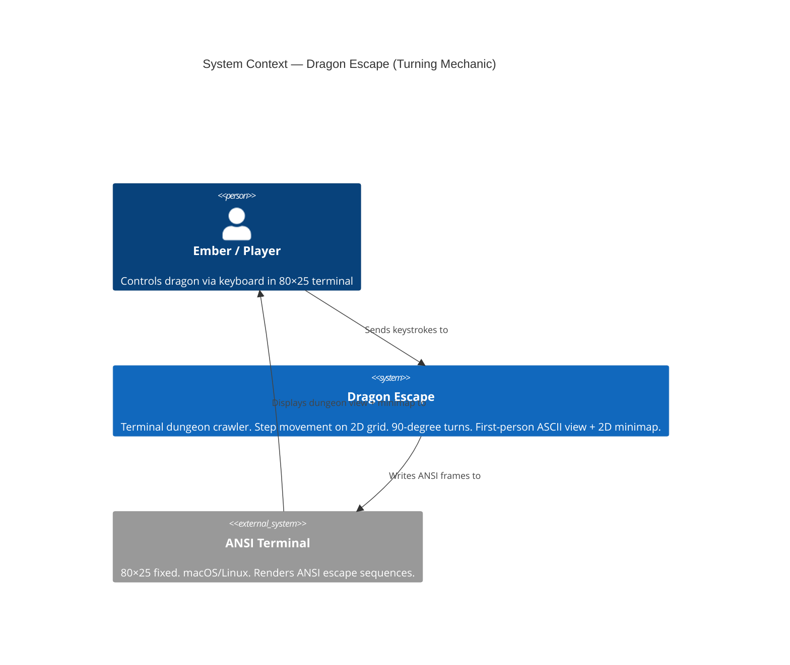
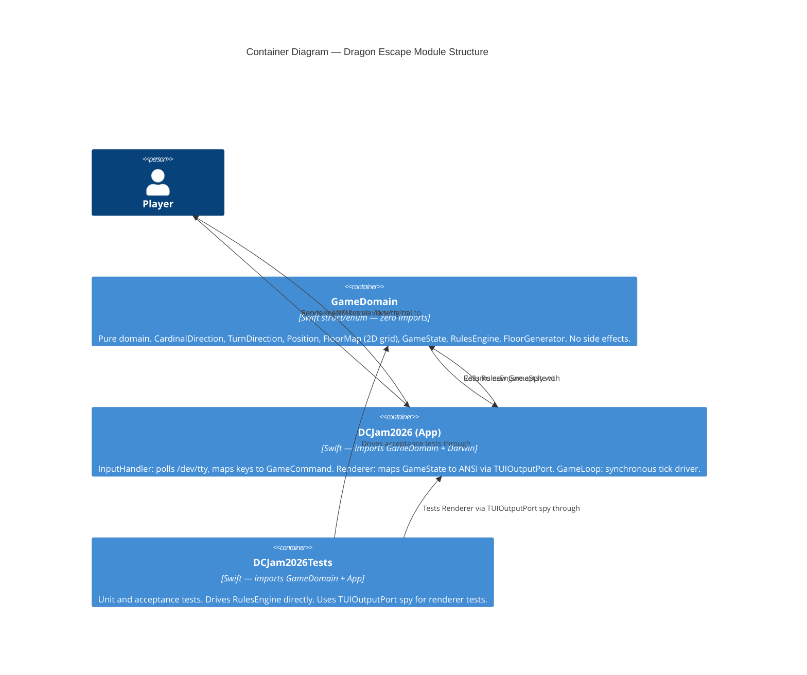
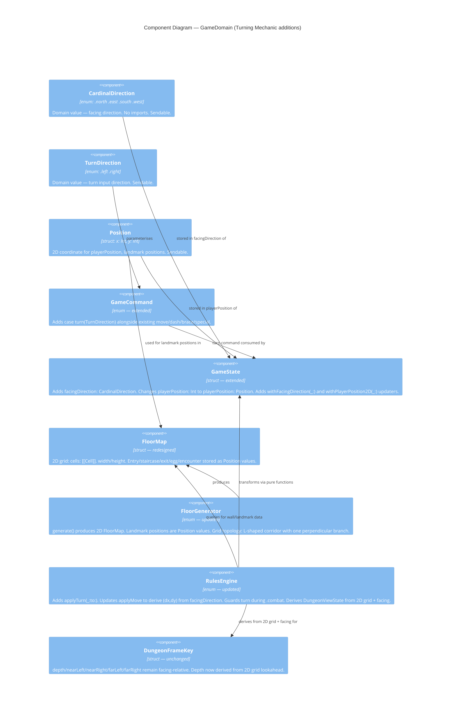

# Architecture Design: Turning Mechanic

**Feature**: turning-mechanic
**Date**: 2026-04-02
**Author**: Morgan (Solution Architect — DESIGN wave)
**Status**: Complete — ready for acceptance-designer

---

## 1. System Context

Dragon Escape is a standalone terminal dungeon crawler running on macOS/Linux. No external services or network integration. The system boundary is the 80×25 ANSI terminal.



---

## 2. Container Diagram

The SwiftPM target structure is the container boundary. Turning mechanic changes touch three containers.



---

## 3. Component Diagram — GameDomain

GameDomain receives three new types and two modified types from this feature. It warrants an L3 diagram.



---

## 4. Architectural Style and Enforcement

This project uses **Ports and Adapters (Hexagonal Architecture)** with **Value-Oriented OOP** confirmed in ADR-002. The architectural style is unchanged by this feature; the turning mechanic extends within the existing boundaries.

Key structural rules and their Swift-specific enforcement:

| Rule | Enforcement Mechanism |
|------|-----------------------|
| `GameDomain` has zero imports from any other module | SwiftPM dependency graph — `GameDomain` target has no `dependencies:` entry. Build failure on violation. |
| All domain types are value types (struct/enum) | Code review. Swift compiler enforces class/struct distinction. |
| RulesEngine functions are pure (no stored mutable state) | `RulesEngine` is an `enum` — cannot hold stored properties. Compiler-enforced. |
| `App` module depends on `GameDomain`; never the reverse | SwiftPM `dependencies:` in Package.swift. Build failure on reverse import. |
| New domain types conform to `Sendable` | Swift 6 strict concurrency mode — compiler error on non-Sendable types crossing isolation boundaries. |

Architecture enforcement tooling recommendation: SwiftPM's own dependency graph is the primary enforcer. For finer-grained import-linting in Swift, the closest available tool is **swift-dependency-checker** (community) or a custom `--scan-build` script. The existing SwiftPM target isolation is sufficient and already enforced at build time — no additional tooling is required for this jam-scope project.

---

## 5. Screen Layout Redesign

The existing layout uses rows 1-25 as follows:

```
Row 1:     top border
Rows 2-16: dungeon view (78×15 interior) — 15 rows
Row 17:    separator
Row 18:    status bar
Row 19:    controls hint
Row 20:    Thoughts separator
Rows 21-24: Thoughts (4 rows)
Row 25:    bottom border
```

A 2D minimap requires a grid-shaped region. The minimap must display a top-down view of the floor. The current floor is at most 11 cells wide and 7 cells tall (see Section 7 for grid dimensions). At 1 character per cell, the minimap grid itself is 11×7 characters. With a 1-column margin, it fits in 13 columns × 7 rows.

### Decision: Vertical Split — Dungeon Left, Minimap Right

The screen is split vertically within the main view area (rows 2-16):

```
┌──────────────────────────────────────────────────────────────────────────────┐ row 1
│                                              │ Floor 2/5      Minimap        │
│          dungeon view (58×15)                │ #########                     │
│                                              │ #..○>..#                      │
│                                              │ #..G...#                      │
│                                              │ #######                       │
│                                              │                               │
│                                              │ N=north                       │
│                                              │ Facing: >                     │
│                                              │                               │
│                                              │                               │
│                                              │                               │
│                                              │                               │
│                                              │                               │
│                                              │                               │
│                                              │                               │
├──────────────────────────────────────────────────────────────────────────────┤ row 17
│ HP [====] EGG [*]  (1)DASH[2]  (2)BRACE  (3)SPEC[====]                      │ row 18
├──────────────────────────────────────────────────────────────────────────────┤ row 19 (separator only)
│ W/S: move   A/D: turn   1: Dash   2: Brace   3: Special   R: restart  Q:quit │ row 20
├─Thoughts─────────────────────────────────────────────────────────────────────┤ row 21
│ "..."                                                                        │ rows 22-24
│ "..."                                                                        │
│ "..."                                                                        │
└──────────────────────────────────────────────────────────────────────────────┘ row 25
```

Exact column split: dungeon view occupies cols 2-59 (58 columns interior). A vertical divider at col 60. Minimap panel occupies cols 61-79 (19 columns interior, sufficient for an 11-wide grid with labels).

Thoughts reduces from 4 rows to 3 rows (rows 22-24) to make room for the controls hint moving to its own row. This is acceptable: Thoughts content is flavor text, not gameplay-critical information.

See ADR-006 for the full decision record on this layout choice.

---

## 6. DungeonFrameKey Depth Calculation in 2D

The existing `DungeonFrameKey` fields are already facing-relative:

- `depth`: how far ahead the wall is
- `nearLeft`/`nearRight`: openings at the player's current cell, to the left/right of current facing
- `farLeft`/`farRight`: openings one cell ahead, to the left/right of current facing

This facing-relative contract is unchanged. What changes is how the Renderer computes these values.

### 2D Lookahead Algorithm (contract for crafter)

Given `playerPosition: Position` and `facingDirection: CardinalDirection`, the Renderer derives a `DungeonFrameKey` by inspecting at most 4 cells ahead in the facing direction, plus 1 cell each side at positions `[player]` and `[player + 1 step forward]`.

The facing direction determines which axis is "forward" and which is "side":

| Facing | Forward delta | Left side delta | Right side delta |
|--------|--------------|----------------|-----------------|
| .north | (0, +1) | (-1, 0) | (+1, 0) |
| .east | (+1, 0) | (0, +1) | (0, -1) |
| .south | (0, -1) | (+1, 0) | (-1, 0) |
| .west | (-1, 0) | (0, -1) | (0, +1) |

`depth` = number of passable cells ahead before hitting a wall, capped at 3. If the cell immediately ahead is a wall, `depth = 0`. One cell ahead is passable but two cells ahead is wall: `depth = 1`. Etc.

`nearLeft` = the cell at `playerPosition + leftDelta` is passable (not a wall).
`nearRight` = the cell at `playerPosition + rightDelta` is passable.
`farLeft` = the cell at `playerPosition + forwardDelta + leftDelta` is passable (only relevant when `depth >= 1`).
`farRight` = the cell at `playerPosition + forwardDelta + rightDelta` is passable.

This logic belongs entirely in the `App` module (Renderer). It reads from `FloorMap` which is a domain type passed through `GameState`. No domain changes are required for the depth calculation — it is a presentation concern.

---

## 7. 2D Floor Layout Design

### Grid Topology for Jam Scope

The jam requires step movement on a square grid. Complex branching layouts are post-jam scope. For this wave, the floor generator produces an **L-shaped corridor** layout: a main corridor running north-south with one east-west branch. This is the simplest 2D layout that:

- Makes turning meaningful (the branch corridor requires actual facing to navigate)
- Places all required landmarks (entry, egg room, guard, staircase, exit)
- Is fully describable by the existing landmark set
- Is generatable by a stateless function with no randomness beyond egg floor selection

### Coordinate Convention

Origin `(0, 0)` is the **south-west corner** of the grid bounding box. Y increases northward. X increases eastward. Entry is always at the southern end of the main corridor.

This convention matches the minimap's visual orientation: north is up, east is right.

### Grid Dimensions

Standard floor grid: 11 columns × 7 rows. The main corridor runs along x=5 (center column) from y=0 (south entry) to y=6 (north staircase/exit). The east-west branch runs along y=3 (middle row) from x=2 to x=8.

```
Y
6  . . . . S . . . . . .     S = staircase (or exit on floor 5)
5  . . . . # . . . . . .
4  . . . . # . . . . . .
3  . . # # # # # . . . .     branch corridor
2  . . . . # . . . . . .
1  . . . . # . . . . . .
0  . . . . E . . . . . .     E = entry
   0 1 2 3 4 5 6 7 8 9 10   X
```

`#` = passable cell (corridor). `.` = wall (impassable).

Landmark positions for a standard floor:
- `entryPosition`: `Position(x: 4, y: 0)`
- `staircasePosition`: `Position(x: 4, y: 6)`
- `eggRoomPosition` (when hasEggRoom): `Position(x: 2, y: 3)` — west end of branch
- `encounterPosition`: `Position(x: 4, y: 3)` — junction of main corridor and branch

On the final floor (floor 5), the boss encounter is at the junction and the exit replaces the staircase.

### FloorMap Cell Type

```
enum Cell {
    case wall
    case corridor
}
```

`FloorMap` stores `cells: [[Cell]]` (row-major: `cells[y][x]`) with dimensions `width: Int` and `height: Int`. All landmark positions are `Position` values.

---

## 8. Quality Attribute Strategies

| Attribute | Strategy |
|-----------|----------|
| **Correctness (jam compliance)** | RulesEngine rotation table tested exhaustively (8 combinations). All movement delta combinations tested (8 facing × direction). CI gate. |
| **Testability** | Domain remains zero-import. RulesEngine pure functions — tested by injecting state directly. No UI or I/O required for any domain test. |
| **Performance** | No heap allocation on turn path. CardinalDirection is a zero-cost enum. Position is a two-Int struct on the stack. Depth calculation is O(4) cell lookups. No regression from 1D. |
| **Maintainability** | Facing-relative DungeonFrameKey contract unchanged — frame table authoring effort unchanged. 2D FloorGenerator is a stateless enum, same pattern as current. |
| **Modifiability** | Branch corridor topology is the simplest 2D layout. Adding more complex layouts post-jam requires only FloorGenerator changes — all consumers use the Cell grid API. |

---

## 9. Integration Points and Risk

| Integration | Risk | Mitigation |
|-------------|------|-----------|
| `GameState.playerPosition: Int` → `Position` | HIGH — touches RulesEngine, Renderer, tests | All callers in a single executable; compiler will find all mismatches. Change in one pass. |
| `FloorMap` landmark positions: `Int` → `Position` | HIGH — same scope | Compiler-driven migration. |
| Renderer depth calculation: 1D → 2D | MEDIUM — logic change, not type change | Extract to a testable pure function in Renderer; snapshot-test the DungeonFrameKey output. |
| Minimap: string → 2D grid region | MEDIUM — screen layout change | New rendering region; does not interact with existing dungeon frame table. |
| InputHandler: add Arrow Left/Right cases | LOW — additive change | Existing escape sequence parser already handles 3-byte sequences. |

No external service integrations. No contract test annotation required.

---

## 10. Architecture Enforcement

Style: Ports and Adapters (Hexagonal)
Language: Swift 6.3
Enforcement: SwiftPM target dependency graph (build-time) + Swift 6 strict concurrency (compile-time)

Rules enforced at build time:
- `GameDomain` target has no `dependencies:` — importing any other module is a build error
- `Sendable` conformance on all domain types crossing concurrency boundaries — compile error on violation
- `RulesEngine` as `enum` — cannot hold stored mutable state — compiler-enforced
- `Position`, `CardinalDirection`, `TurnDirection` as `struct`/`enum` — value semantics, no reference aliasing
