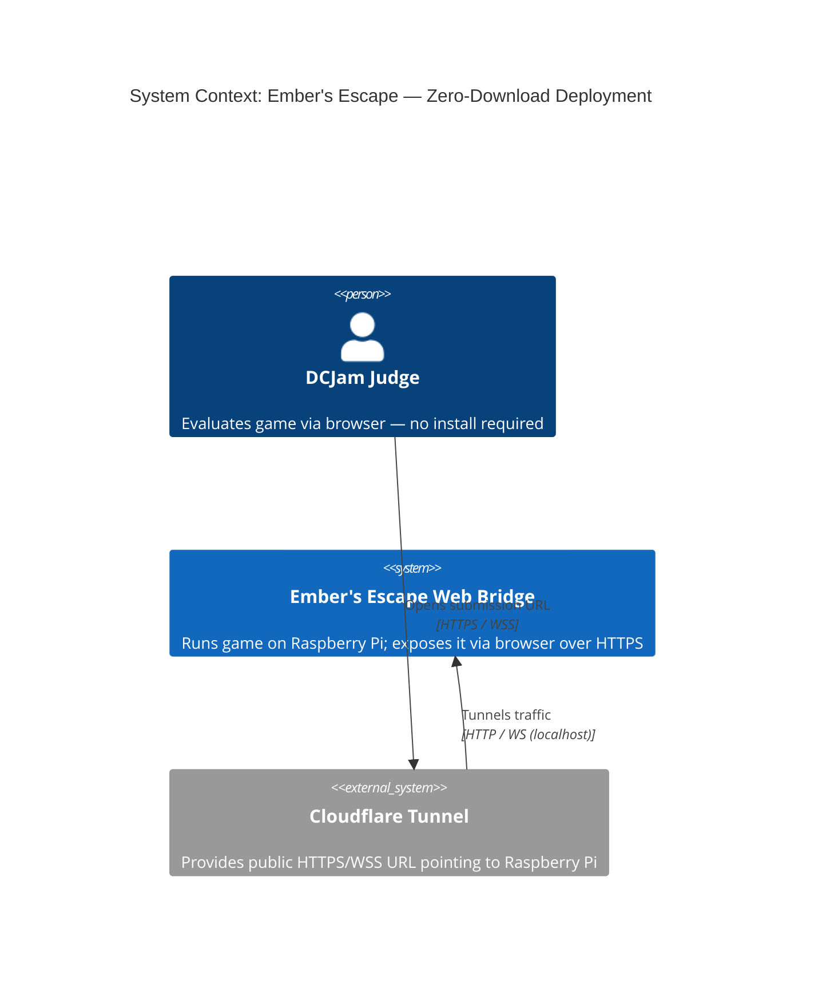
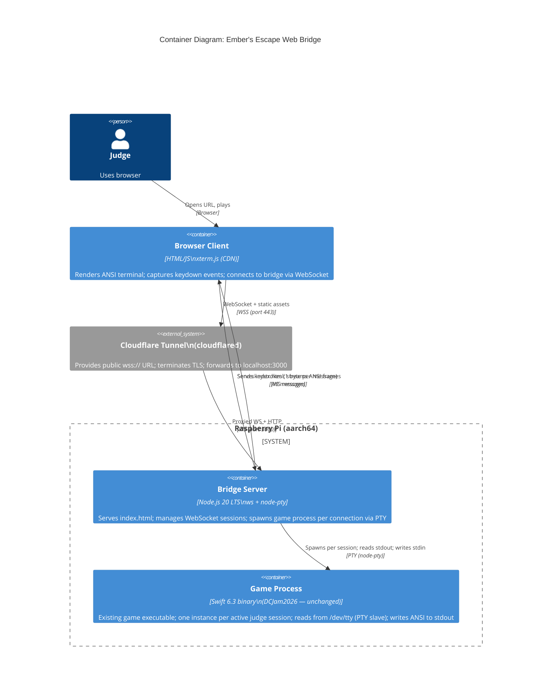

# Architecture Design — zero-download-deployment

**Feature**: WebSocket/xterm.js browser bridge for Ember's Escape  
**Wave**: DESIGN  
**Date**: 2026-04-04  
**Author**: Morgan (Solution Architect)

---

## Architecture Pattern

**Thin bridge / process-per-session**

No framework, no abstraction layers beyond what the problem requires. The bridge is a ~80-line Node.js script that:
1. Serves a static `index.html`
2. Accepts WebSocket connections
3. Spawns the existing Swift game binary inside a PTY per connection
4. Pipes bytes bidirectionally between the WebSocket and the PTY

The Swift game binary is completely unchanged. All game logic, rendering, and input handling remain in the existing Swift package.

---

## Why PTY, Not stdio Pipe

This is the single most important architectural decision. `InputHandler.swift` opens `/dev/tty` directly:

```swift
fd = open("/dev/tty", O_RDONLY | O_NONBLOCK)
```

A simple `child_process.spawn()` with stdio pipes does **not** give the child process a controlling terminal — `/dev/tty` would not exist (or would refer to the Node.js server's own terminal). The game would fail to read input.

`node-pty` spawns the process inside a **pseudo-terminal (PTY)**. The PTY slave becomes the process's controlling terminal, so:
- `open("/dev/tty", ...)` resolves to the PTY slave — input works
- `tcsetattr(STDIN_FILENO, ...)` operates on a real tty fd — raw mode works
- stdout writes to the PTY slave and are read from the PTY master by Node.js

This is why `node-pty` is a hard requirement, not an optional convenience.

---

## C4 System Context Diagram



---

## C4 Container Diagram



---

## Data Flow

### Connection establishment
```
Judge opens URL
  → Cloudflare Tunnel → Node.js serves index.html
  → xterm.js initialises (80 cols × 25 rows)
  → Browser opens WebSocket to wss://host/game
  → Node.js: ws connection event
  → node-pty.spawn("DCJam2026", [], { cols: 80, rows: 25 })
  → Swift process starts; start screen renders to PTY stdout
  → Node.js reads PTY output → sends as WS binary message
  → xterm.js.write(data) → start screen visible in browser
```

### Input loop (per keypress)
```
Judge presses key
  → xterm.js keydown handler → ws.send(keyBytes)  [1-3 bytes]
  → Node.js WS message event → pty.write(keyBytes)
  → PTY stdin → Swift InputHandler reads from /dev/tty
  → RulesEngine.tick() → Renderer.render() → ANSI frame to stdout
  → Node.js PTY data event → ws.send(ansiFrame)
  → xterm.js.write(ansiFrame) → frame rendered
```

### Teardown
```
Judge closes tab
  → WebSocket 'close' event in Node.js
  → pty.kill('SIGTERM')
  → Swift process receives SIGTERM → exits
  → PTY fd closed; Node.js session entry removed
```

---

## Session Isolation

Each WebSocket connection creates a completely independent OS process (via `node-pty.spawn`). Node.js holds a map of `ws → pty` pairs. Sessions share no memory and cannot interfere with each other. Session isolation is guaranteed by OS process boundaries, not by application-level locking.

---

## Terminal Size Handling

xterm.js is initialised with `cols: 80, rows: 25` in `index.html`. This matches the game's fixed 80×25 layout. The Node.js server checks the browser's reported terminal size on connection (sent as the first WebSocket message). If smaller than 80×25, the server writes a warning string to the PTY stdin before the game reads it — or more cleanly, the server writes directly to the WebSocket before spawning the game process.

---

## Implementation File Layout

```
infrastructure/            ← new; outside Swift package
  web/
    server.js              ← ~80 lines: Node.js bridge (ws + node-pty)
    index.html             ← ~40 lines: xterm.js page + WS client
    package.json           ← deps: ws ^8, node-pty ^1
    package-lock.json      ← generated
  deploy/                  ← see design/deployment/ for architecture
    Dockerfile
    docker-compose.yml
    cloudflared.yml
  tests/
    acceptance/            ← Gherkin feature files + Node.js test runner
      steps/
        bridge.test.js
```

The Swift package (`Package.swift`, `Sources/`) is completely unmodified by this feature.

---

## Changed Assumptions

None. Architecture is consistent with all DISCUSS wave decisions and constraints.
