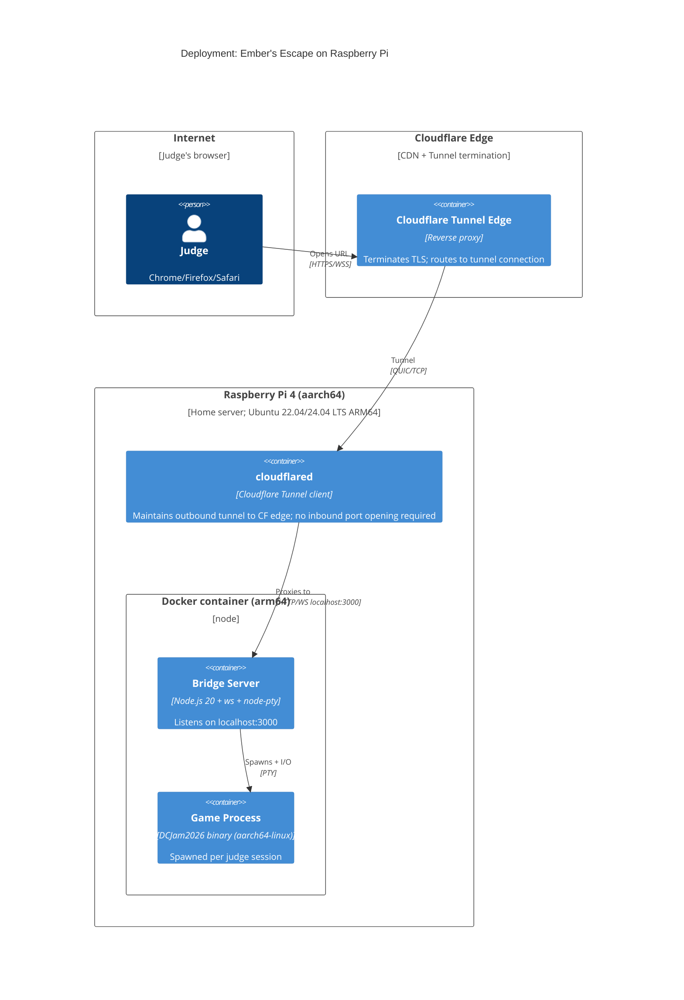

# Deployment Architecture — zero-download-deployment

**Target**: Raspberry Pi running Ubuntu (aarch64 / ARM64 Linux)  
**Public access**: Cloudflare Tunnel  
**Packaging**: Docker (ARM64)

---

## Overview

```
Internet
    ↓ HTTPS/WSS  (*.trycloudflare.com or custom domain)
Cloudflare Edge
    ↓ tunnel (outbound connection from RPi — no inbound port forwarding needed)
Raspberry Pi
    ├── cloudflared daemon  (Cloudflare Tunnel client)
    └── Docker container
          ├── Node.js bridge server  (port 3000, localhost only)
          └── DCJam2026 Swift binary  (spawned per session by bridge)
```

---

## C4 Deployment Diagram



---

## Swift Binary for ARM64

The Swift game executable must be compiled for `aarch64-unknown-linux-gnu`. Two options:

### Option A — Cross-compile on macOS (preferred for CI)
```bash
swift build --swift-sdk aarch64-swift-linux-musl -c release
```
Produces a statically-linked binary. No Swift runtime required on the RPi.

### Option B — Native compile on the RPi
```bash
swift build -c release
```
Requires Swift 6.3 installed on the RPi. Slower build but zero cross-compilation setup. Viable for a jam: build once on the RPi itself.

**Recommendation for jam**: Option B (native compile on RPi) — simpler, no cross-compile SDK needed, build time ~2-3 minutes on RPi 4.

---

## Docker Image

Multi-stage build to keep the final image small:

**Stage 1** — Build Swift binary (runs on RPi or in CI with `--platform linux/arm64`):
```
FROM swift:6.3-jammy AS builder
COPY . /build
WORKDIR /build
RUN swift build -c release
```

**Stage 2** — Runtime image:
```
FROM arm64v8/node:20-alpine
COPY --from=builder /build/.build/release/DCJam2026 /usr/local/bin/DCJam2026
COPY web/ /app/web/
WORKDIR /app/web
RUN npm ci --omit=dev
EXPOSE 3000
CMD ["node", "server.js"]
```

`node-pty` requires native compilation — `npm ci` in the Alpine image handles this via `node-gyp`. The Alpine image must have build tools: `apk add --no-cache python3 make g++` before `npm ci`.

---

## Cloudflare Tunnel

Cloudflare Tunnel (`cloudflared`) creates an outbound-only encrypted connection from the RPi to Cloudflare's edge. No router port forwarding required.

### Quick-start tunnel (no account, 24h URL)
```bash
cloudflared tunnel --url http://localhost:3000
```
Prints a `*.trycloudflare.com` URL. Valid for ~24 hours. Sufficient for a jam judging window.

### Persistent tunnel (recommended for judging period)
1. `cloudflare tunnel login` (one-time)
2. `cloudflare tunnel create embers-escape`
3. Configure `deploy/cloudflared.yml`:
```yaml
tunnel: <tunnel-id>
credentials-file: /etc/cloudflared/credentials.json
ingress:
  - hostname: embers-escape.yourdomain.com
    service: http://localhost:3000
  - service: http_status:404
```
4. Run as a systemd service on the RPi for persistence during judging.

---

## docker-compose.yml Structure

```yaml
services:
  embers-escape:
    image: embers-escape:latest
    restart: unless-stopped
    ports:
      - "127.0.0.1:3000:3000"   # localhost only — Cloudflare Tunnel proxies externally
    environment:
      - NODE_ENV=production
```

The bridge server only binds to `127.0.0.1:3000`. Cloudflare Tunnel connects to it locally. No direct external port exposure.

---

## Judging Window Checklist

### Step 0 — Verify native build before touching Docker (do this first)
Confirms Swift 6.3 is installed correctly on the RPi and the binary actually runs before
adding Docker as a variable.
```bash
swift build -c release
.build/release/DCJam2026
```
You should see the start screen in your terminal. If this works, Docker is just packaging.

### Step 1 — Build and run Docker image
- [ ] `docker build --platform linux/arm64 -t embers-escape -f infrastructure/deploy/Dockerfile .`
- [ ] `docker compose -f infrastructure/deploy/docker-compose.yml up -d`
- [ ] Verify locally: `curl http://localhost:3000` returns the HTML page

### Step 2 — Cloudflare Tunnel
- [ ] `cloudflared tunnel run embers-escape` (or via systemd)
- [ ] Confirm tunnel URL is printed / visible in Cloudflare dashboard

### Step 3 — Cross-browser smoke test
- [ ] Open tunnel URL in Chrome — see start screen, play to first room
- [ ] Open tunnel URL in Firefox — same
- [ ] Open tunnel URL in Safari — same

### Step 4 — Submit
- [ ] Include public tunnel URL in DCJam 2026 submission notes

---

## Resource Usage (Estimated, Raspberry Pi 4)

| Resource | Idle (no sessions) | Per active session |
|---|---|---|
| RAM | ~50 MB (Node.js) | +~15 MB (Swift process) |
| CPU | ~0% | ~2-5% (30 Hz game loop) |
| Network | ~0 | ~5-20 KB/s (ANSI frames) |

A Raspberry Pi 4 with 4 GB RAM can comfortably support 10+ simultaneous judge sessions.
