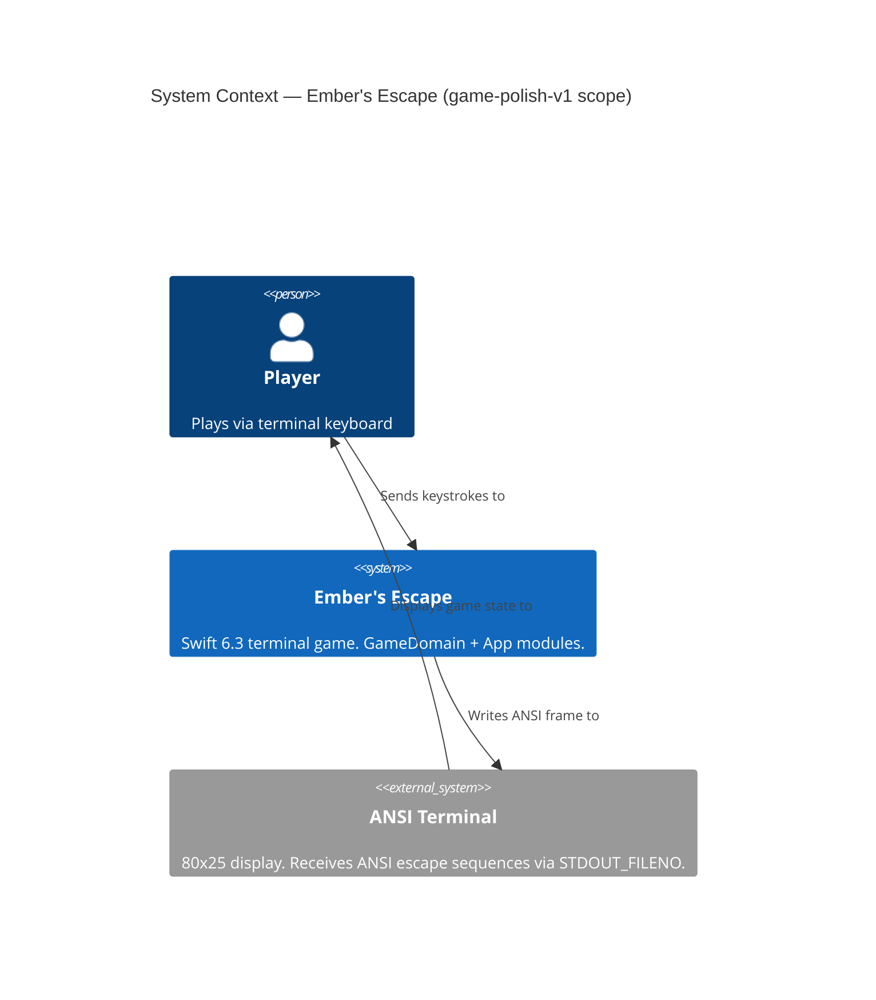
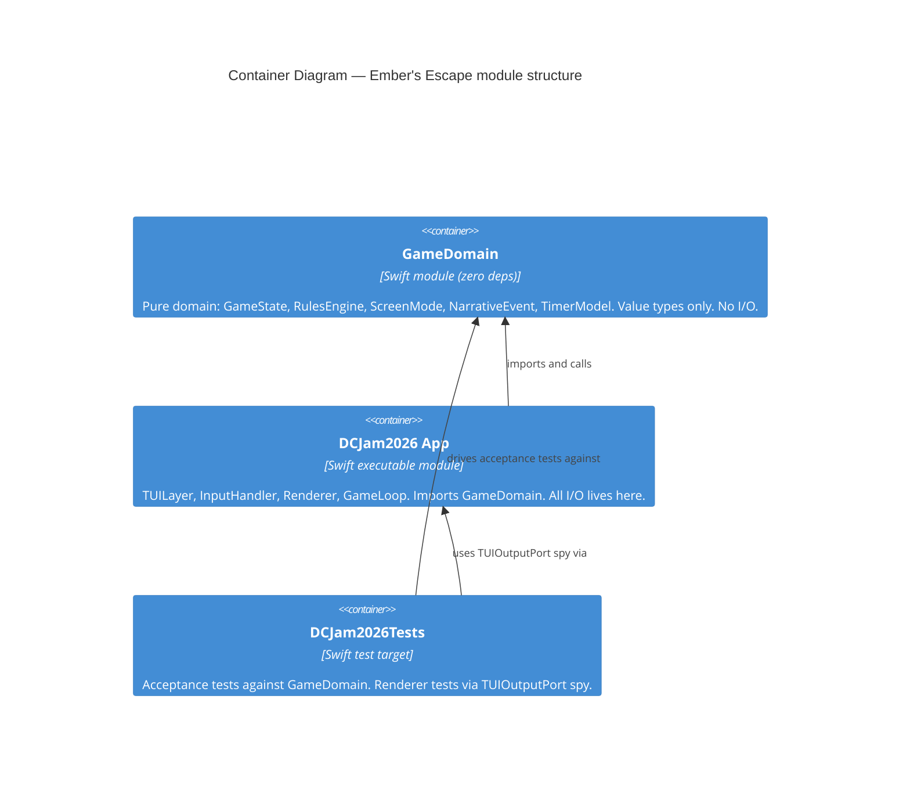
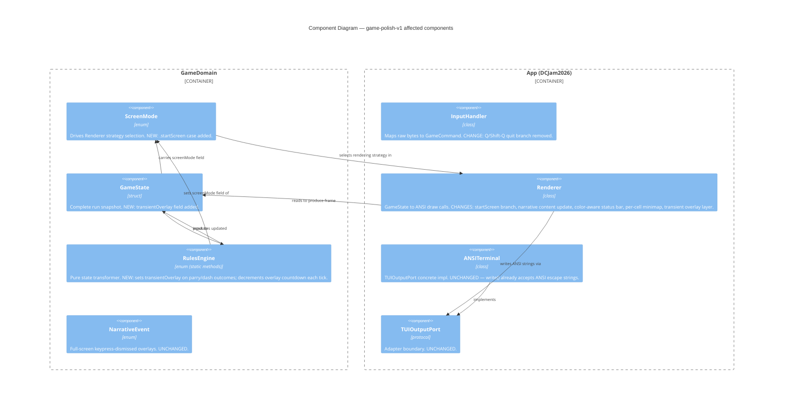

# Architecture Design — game-polish-v1
**Feature**: game-polish-v1 — Ember's Escape polish pass
**Date**: 2026-04-03
**Author**: Morgan (Solution Architect — DESIGN wave)
**Status**: APPROVED — ready for acceptance-designer and software-crafter

---

## 1. System Context

Ember's Escape is a single-binary Swift 6.3 terminal game. The architecture is a confirmed
modular monolith with ports-and-adapters enforced by SwiftPM module boundaries. This feature
adds seven polish items to an existing, working game. No new modules are introduced.



---

## 2. Container Architecture (C4 L2)



**Dependency rule (unchanged)**: GameDomain has zero imports. App imports GameDomain.
All polish changes respect this boundary — new ScreenMode cases and GameState fields live
in GameDomain; all rendering decisions live in App.

---

## 3. Component Architecture (C4 L3) — Affected Components

The components below are the specific files touched by game-polish-v1. Unaffected files are omitted.



---

## 4. Polish Item Placement Map

Each story maps to exactly one component boundary.

| Story | Domain changes (GameDomain) | App changes (App) |
|-------|----------------------------|-------------------|
| US-P01 Start Screen | `ScreenMode.startScreen` new case; `GameState.initial()` starts in `.startScreen` | `Renderer.renderStartScreen()` new branch; `InputHandler` anyKey-dismisses start screen |
| US-P02 Remove Q quit | None | `InputHandler.mapKey()` — remove `q`/`Q` quit branch |
| US-P03 Egg screen | None — `NarrativeEvent.eggDiscovery` unchanged | `Renderer.narrativeContent(.eggDiscovery)` — replace text + ANSI colors |
| US-P04 Win screen | None — `ScreenMode.winState` unchanged | `Renderer.renderWinScreen()` — replace content + ANSI colors |
| US-P05a HP color | None | `Renderer.drawStatusBar()` — wrap hpBar in threshold-derived ANSI color |
| US-P05b Charge/cooldown color | None | `Renderer.drawStatusBar()` — wrap specBar/braceCooldown in ANSI color |
| US-P05c Minimap color | None | `Renderer.renderMinimap()` — per-cell write with ANSI color + reset |
| US-P06 Brace overlays | `TransientOverlay` enum + `GameState.transientOverlay` field; `RulesEngine.applyEnemyAttackTick()` sets overlay; `RulesEngine.advanceTimers()` decrements countdown | `Renderer.render()` — overlay layer after base screen |
| US-P07 Dash overlay | `RulesEngine.applyDash()` sets `.dash` transient overlay | `Renderer.render()` — same overlay layer as US-P06 |

---

## 5. New ScreenMode Case: `.startScreen`

**Location**: `Sources/GameDomain/ScreenMode.swift`

Add `.startScreen` as a new case. No associated value needed.

`GameState.initial(config:)` must set `screenMode: .startScreen` so the game opens
on the start screen. The Renderer strategy switch handles this case with `renderStartScreen()`.

The start screen is dismissed by any keypress. The `confirmOverlay` game command is re-used for
this purpose — the Renderer branch does not need a new command. `RulesEngine.applyConfirmOverlay()`
must be extended to handle `.startScreen` by transitioning to `.dungeon`.

**Priority rule**: `.startScreen` transition to `.dungeon` happens before any game-timer advancement.
The start screen holds while `screenMode == .startScreen` regardless of deltaTime.

---

## 6. Transient Overlay Mechanism (resolves OPEN-04 and OPEN-05)

**Decision**: Option A — `transientOverlay: TransientOverlay?` field in `GameState`.

**Rationale**: The frame countdown belongs in GameState, not Renderer, because:
1. It is part of the game's observable state — unit tests can verify countdown lifetime.
2. RulesEngine is the only place that knows when a parry outcome fires; it sets the overlay there.
3. Keeping timing logic out of Renderer preserves the single-responsibility boundary.
4. Option B (NarrativeEvent cases + Renderer timer) mixes timing into the presentation layer,
   making the mechanic untestable without a running terminal.

**Rejected alternative — Option B**: New `NarrativeEvent` cases with countdown in Renderer.
Rejected because NarrativeEvent overlays are keypress-dismissed full-screen events; transient
overlays are frame-counted non-blocking sub-screen decorations. They are architecturally distinct.
Conflating them would require the Renderer to own a countdown timer, violating the principle
that domain-observable state belongs in GameDomain.

**Design**:

`TransientOverlay` enum (new type in GameDomain):

```
enum TransientOverlay: Equatable, Sendable {
    case braceSuccess(framesRemaining: Int)   // "SHIELDED!" — bright cyan
    case braceHit(framesRemaining: Int)       // "STRUCK!"   — bright red
    case dash(framesRemaining: Int)           // "SWOOSH!"   — bold white
}
```

`GameState` gains one new field:

```
public var transientOverlay: TransientOverlay?
```

And one new `with` helper: `withTransientOverlay(_ overlay: TransientOverlay?) -> GameState`.

**Lifetime management in RulesEngine**:

`RulesEngine.advanceTimers()` decrements `framesRemaining` each tick. When `framesRemaining`
reaches zero, the field is set to `nil`. This happens unconditionally on every tick — the
Renderer just reads the current value.

`applyEnemyAttackTick()` sets `.braceSuccess` or `.braceHit` as appropriate, with
`framesRemaining: 23` (WAVE-DEC-02: ~0.75s at 30Hz).

Exception: if the hit kills the player (newHP == 0), `transientOverlay` is set to `nil`
and screenMode transitions to `.deathState`. The death screen takes priority.

`applyDash()` sets `.dash(framesRemaining: 23)`.

**Priority rules** (Renderer layer ordering):
1. `.deathState` / `.winState` — full-screen; transient overlay is not rendered.
2. `.narrativeOverlay` / `.upgradePrompt` / `.startScreen` — full-screen; transient overlay
   is not rendered (overlay word is meaningless outside game view).
3. `.dungeon` / `.combat` — base screen rendered first; if `transientOverlay != nil`,
   overlay word rendered on top at row 9, centered in the main view.

---

## 7. Color Rendering Strategy

**Current state**: `TUIOutputPort.write(_ string: String)` accepts any string including
ANSI escape sequences. `ANSITerminal` appends bytes directly to its buffer. No color-specific
method exists on the protocol — colors are embedded as escape sequences in strings passed
to `write()`.

**Design decision (WAVE-DEC-05)**: Minimap color uses per-cell writes.

`renderMinimap()` currently builds each row as a `String(rowChars)` and writes the whole
row in one call. For per-cell coloring this must change to a loop that, for each cell:
1. Calls `output.moveCursor(row: screenRow, col: 61 + x)`.
2. Calls `output.write(ansiColor + char + ansiReset)`.

This is a contained change inside `renderMinimap()`. The col calculation accounts for
the 19-wide right panel (cols 61-79) being 15 cells wide (the floor grid is 15×7).

**ANSI color constants** are defined as module-private constants in Renderer or a companion
file `ANSIColors.swift` within the App module. They are not exported to GameDomain.
GameDomain never contains ANSI escape strings.

**Color bleed prevention**: Every colored segment is terminated with `\u{1B}[0m` (reset).
This is an AC requirement for all five US-P05 sub-stories and is enforced structurally:
each color helper function appends the reset in its own return value so callers cannot
forget it.

---

## 8. Start Screen Layout

The start screen replaces the entire 80×25 terminal. No chrome, no status bar, no minimap.

`renderStartScreen()` in Renderer:
- Clears the screen completely (`output.clearScreen()`).
- Does not call `drawChrome()`.
- Renders in the full 80×25 area (rows 1–25, cols 1–80).
- Content: title "Ember's Escape" centered bold, "DCJam 2026" beneath, narrative hook,
  controls table listing W/S/A/D/1/2/3/ESC, "[ Press any key to begin ]" prompt.
- Q is not mentioned anywhere in the rendered content.

`render(_ state: GameState)` switch statement gains a new case:

```
case .startScreen:
    renderStartScreen()
    // No chrome, no status bar, no thoughts panel, no controls bar call
```

---

## 9. Narrative Content Changes (US-P03 and US-P04)

Both are pure content changes inside `Renderer.swift`. No new types, no new GameDomain
changes. The methods `narrativeContent(.eggDiscovery)` and `renderWinScreen()` receive
new text and ANSI color codes derived from spike2.

Win screen requires a stat block (floors cleared, HP remaining) — these values come from
`GameState.currentFloor` and `GameState.hp` already passed to `renderWinScreen(state:)`.

The win screen prompt changes from `[ press any key ]` to `[ Press R to play again ]`
(AC: P04-AC-07). This is rendering content only. The `restart` GameCommand already handles R.

---

## 10. Quality Attribute Strategies

**Testability**
- `TransientOverlay.framesRemaining` is inspectable from tests — `GameState` is a value type;
  tests can verify overlay is set after a parry, and cleared after 23 ticks via injected deltaTime.
- `InputHandler.mapKey(bytes:)` is already public — tests verify Q produces `.none`.
- `TUIOutputPort` spy pattern (already used) captures all `write()` calls; tests verify
  ANSI codes appear in status bar output for HP thresholds.

**Maintainability**
- Transient overlay lifetime (23 frames) is a named constant — not scattered magic numbers.
- ANSI color constants in one companion location (not duplicated across Renderer methods).
- ScreenMode is the single dispatch table for all rendering — adding `.startScreen` follows
  the existing pattern exactly.

**Safety**
- Fatal-hit priority rule (deathState beats STRUCK overlay) is enforced in `applyEnemyAttackTick()`
  by explicit `nil`-out before setting `.deathState`.
- Value-type GameState makes every tick's state snapshot independent — no mutable overlay
  state can bleed between frames.

---

## 11. Architecture Enforcement

SwiftPM itself enforces the primary dependency rule: GameDomain declares no dependencies.
Any import of App from GameDomain is a build error.

For rule enforcement within App (e.g., no ANSI escape strings constructed outside the
designated color helper location), the recommended tool is
**swift-package-manager-plugin or a custom Swift lint rule via SwiftLint**.

Specific rule to encode: `ANSI_COLOR_RULE: no raw "\u{1B}[" literal outside ANSIColors.swift`.
This prevents color logic creeping into domain files if the codebase grows.

---

## 12. What Is Not Changed

The following are confirmed out of scope and must not be touched:

- `NarrativeEvent` enum — no new cases (egg/patio/special remain as-is; transient overlays
  are a separate type).
- `ScreenMode.winState` — win condition logic unchanged; only rendering content changes.
- `TUIOutputPort` protocol — no new color methods needed; ANSI in strings is sufficient.
- `ANSITerminal` — no changes required.
- `GameLoop` — no changes required.
- `Package.swift` — no new modules or dependencies.
- Game rules (damage, timing constants) — all unchanged.
