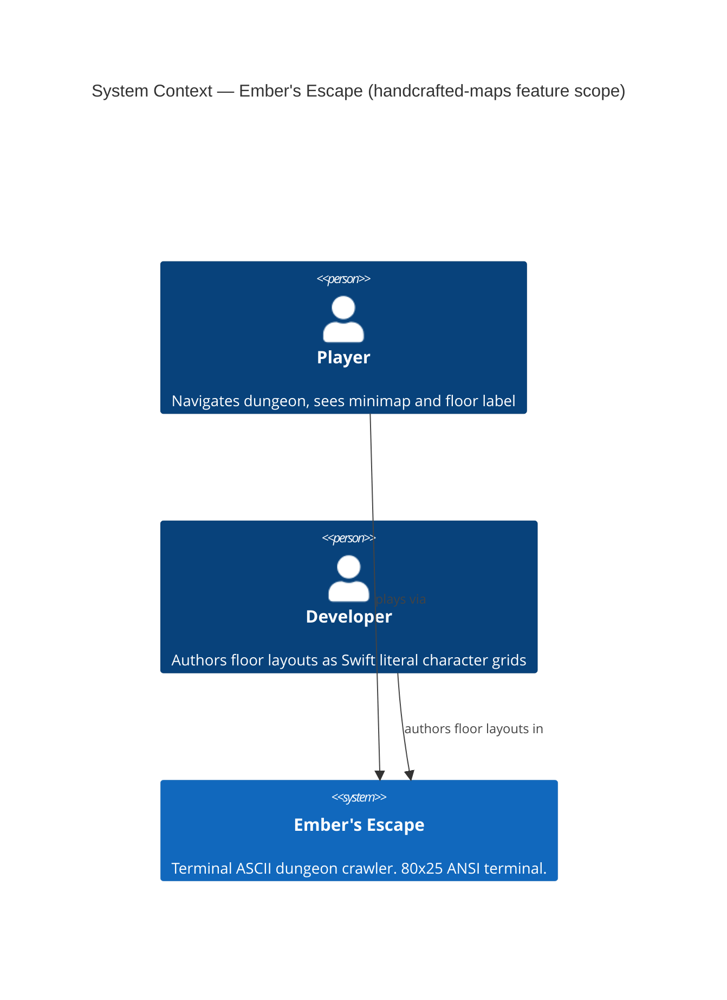
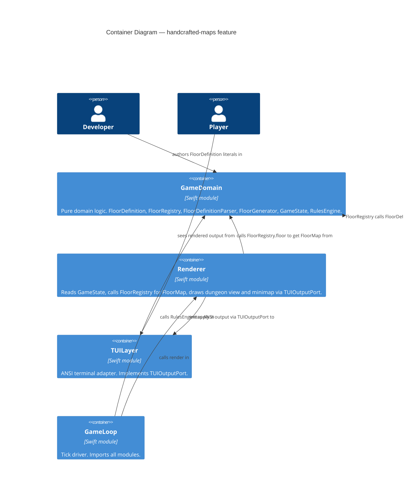

# Architecture Design — handcrafted-maps

**Feature**: handcrafted-maps
**Wave**: DESIGN
**Date**: 2026-04-04
**Agent**: Morgan (nw-solution-architect)

---

## 1. Business Drivers and Quality Attributes

Extracted from requirements.md and outcome-kpis.md:

| Priority | Driver | Source |
|----------|--------|--------|
| 1 | **Maintainability** — adding a floor requires exactly one file change, zero algorithm changes (KPI-HM-05) | REQ-HM-01 |
| 2 | **Correctness** — floor 1 migration must produce cell-for-cell identical output (KPI-HM-03) | REQ-HM-02 |
| 3 | **Engagement** — player perceives each floor as spatially distinct (KPI-HM-01) | REQ-HM-05 |
| 4 | **Simplicity** — jam-scope; no file I/O, no external data format, pure Swift literals | wave-decisions.md |
| 5 | **Backwards compatibility** — existing tests calling `FloorGenerator` directly continue to pass | REQ-HM-02 |

Key constraints:
- Swift 6.3 strict concurrency — all new types must be `Sendable`
- `GameDomain` module: zero imports from other modules (enforced by SwiftPM)
- No external dependencies
- Single developer — no cross-team Conway's Law tension; simplest structure wins

---

## 2. Conway's Law Assessment

Single developer project. No cross-team boundaries exist. Architecture is driven purely by:
- Module dependency rules (SwiftPM enforces `GameDomain` independence)
- Testability (separating data from lookup from parsing enables focused unit tests)
- Jam timeline (minimal surface area, no speculative generality)

---

## 3. C4 System Context Diagram (L1)



---

## 4. C4 Container Diagram (L2)



---

## 5. Architectural Approach

**Style**: Value-Oriented OOP (confirmed in docs/CLAUDE.md, ADR-002). All new types are pure value types (`struct` or `enum` namespace).

**Pattern**: Ports-and-adapters is already established (`TUIOutputPort`, `InputPort`). This feature does not add new ports — it restructures the floor data pipeline within `GameDomain`.

**Default applied**: Modular monolith (already the architecture). No new module added. All new types live in the existing `GameDomain` module.

### Data Pipeline (new vs. existing)

```
BEFORE:
  RulesEngine / Renderer
      → FloorGenerator.generate(floorNumber:config:)
      → FloorMap

AFTER:
  RulesEngine / Renderer
      → FloorRegistry.floor(floorNumber:config:)
      → FloorDefinitionParser.parse(definition:floorNumber:config:)
      → FloorMap
```

`FloorGenerator` remains unchanged and continues to serve its existing test call sites.

---

## 6. New Components

### 6.1 `FloorDefinition` (GameDomain)

Pure data container. No logic, no computed properties beyond those required by `Sendable`. Holds the character grid as `[String]`.

**Responsibility**: Express a single floor's topology as a self-contained, human-readable character grid literal.

**Boundaries**:
- Depends on: nothing (no imports)
- Depended on by: `FloorRegistry`, `FloorDefinitionParser`
- Must not contain: game rules, positional logic, FloorGrid construction

### 6.2 `FloorDefinitionParser` (GameDomain)

Stateless namespace (enum with static methods or struct with no stored properties, consistent with `FloorGenerator` and `RulesEngine` pattern).

**Responsibility**: Convert a `FloorDefinition` character grid into a `FloorGrid` (passability cells) and extract all landmark `Position` values by scanning the grid once.

**Boundaries**:
- Depends on: `FloorDefinition`, `FloorGrid`, `FloorCell`, `Position`
- Depended on by: `FloorRegistry`
- Must not contain: floor-number-specific game rules (e.g., "egg room on floors 2-4"). Those rules live in `FloorRegistry`.

**Parsing contract**:
- `#` → `FloorCell(isPassable: false)`
- All other vocabulary characters → `FloorCell(isPassable: true)`
- Scan grid once to find positions of `^`/`>`/`v`/`<` (entry + facing), `G`, `B`, `*`, `S`, `X`, `E`
- Returns a named tuple or intermediate struct containing `FloorGrid` + extracted positions

### 6.3 `FloorRegistry` (GameDomain)

Stateless namespace. Contains five `FloorDefinition` constants (one per floor) and the single public interface `floor(_ floorNumber: Int, config: GameConfig) -> FloorMap`.

**Responsibility**: Map floor number → `FloorMap`. Apply floor-number-specific game rules (egg room eligibility, boss, exit) when constructing `FloorMap` from a parsed `FloorDefinition`.

**Boundaries**:
- Depends on: `FloorDefinition`, `FloorDefinitionParser`, `FloorMap`, `GameConfig`
- Depended on by: `RulesEngine`, `Renderer`
- Must not contain: character-grid parsing logic (delegated to `FloorDefinitionParser`)
- `FloorGenerator` is NOT a dependency — no call chain between them

**Game rules applied in `FloorRegistry.floor(_:config:)`**:
- `hasEggRoom`: derived from whether grid contains `*` AND floor is not 1 or maxFloors (cross-check with grid character — the grid is authoritative)
- `hasBossEncounter`: derived from `B` in grid
- `hasExitSquare`: derived from `X` in grid
- These flags must match what the grid encodes — parser extracts positions; registry validates flag consistency

### 6.4 Floor label in `Renderer` (App layer — Renderer module)

**Current state** (line 241-243 of Renderer.swift):
```
let floorLabel = " Floor \(state.currentFloor)/\(state.config.maxFloors) "
output.moveCursor(row: 2, col: 80 - floorLabel.count)
output.write(floorLabel)
```
This writes into row 2, overwriting the minimap top row.

**New design**: The floor label is written at row 2, cols 61–79, directly inside `renderDungeon()`. The minimap then starts at row 3. `drawChrome()` signature is unchanged — no parameter threading required.

**Rationale**: Floor state is already available in `renderDungeon`. The label placement is a localized two-line change with no impact on any other render path. Extending `drawChrome` to accept an optional parameter would be unnecessary complexity for a jam-scope single-developer project. See ADR-018.

**Legend interaction**: The legend occupies rows 10–16. With the minimap starting at row 3, a floor of height H occupies rows 3 to `3 + H - 1`. To avoid overlap, H must be ≤ 7. All handcrafted floors are authored at 7 rows maximum (authoring constraint). `drawMinimapLegend()` is called unconditionally — no runtime height check required. See ADR-019.

---

## 7. Call Site Changes

| Call Site | File | Change |
|-----------|------|--------|
| `renderDungeon` | `Sources/App/Renderer.swift` | Replace `FloorGenerator.generate` with `FloorRegistry.floor`; replace row-2 floor label write with row-2 cols 61–79 write; update minimap start row from 2 to 3 |
| `applyMove` | `Sources/GameDomain/RulesEngine.swift` | Replace two `FloorGenerator.generate` calls (lines 173 and 184) with `FloorRegistry.floor` |
| `applySpecial` | `Sources/GameDomain/RulesEngine.swift` | Replace one `FloorGenerator.generate` call (line 278) with `FloorRegistry.floor` |

`drawChrome` is not modified. Its signature and all existing call sites remain unchanged.

`FloorGenerator` call sites in tests: **no change required**. `FloorGenerator.generate` remains public and unchanged.

---

## 8. Five Floor Layouts (Topology Specification)

The crafter's responsibility is **migration only**: define `FloorDefinition`, `FloorDefinitionParser`, and `FloorRegistry`; populate `FloorRegistry` with floor 1 expressed as a character grid identical in topology to `FloorGenerator` output today; and update the four `FloorGenerator` call sites to use `FloorRegistry`. The crafter does not author floors 2–5. Floor authoring beyond floor 1 is explicitly out of scope for the crafter and will be done by the developer.

All floors must be at most 7 rows tall (height cap from ADR-019). Width up to 19 (right-panel interior). Topology variety is achieved through width and shape, not height.

| Floor | Shape | W | H | Author | Notes |
|-------|-------|---|---|--------|-------|
| 1 | L-shaped corridor | 15 | 7 | Crafter | Matches `FloorGenerator` topology exactly. Entry `^` at (7,1), staircase `S` at (7,6), guard `G` at (7,4), branch y=4 x=2..7, no `*`. Height 7 matches original `FloorGenerator` output. |
| 2–5 | TBD | TBD | ≤7 | Developer | Distinct topologies to be authored by developer after crafter delivers migration. Character grids populate `FloorRegistry` constants directly. |

**Note on floor 1 height**: The original `FloorGenerator` produces a 7-row floor (y=0 to y=6). The height cap at 7 means the crafter authors a 7-row grid that matches the original dimensions exactly. The topology (L-shape, same landmark positions) is fully preserved; the grid is 15×7, identical in height to `FloorGenerator` output. AC-HM-02-A (migration gate) may compare `FloorRegistry` output to `FloorGenerator` with an exact dimension match.

---

## 9. Quality Attribute Strategies

**Maintainability**: Data and logic are separated across three types (`FloorDefinition` = data, `FloorDefinitionParser` = conversion, `FloorRegistry` = lookup + rules). Adding floor 6 requires adding one `FloorDefinition` constant and one case in the registry switch.

**Testability**: `FloorDefinitionParser` is a pure function — given a `FloorDefinition`, it always returns the same parsed result. `FloorRegistry.floor` is a pure function. Both are directly testable without mocking.

**Backward compatibility**: `FloorGenerator` is not modified or deleted. All tests calling it continue to compile and pass.

**Sendable safety**: `FloorDefinition` is a struct holding `[String]` — both are `Sendable`. `FloorRegistry` and `FloorDefinitionParser` are stateless namespaces — inherently `Sendable`.

---

## 10. Enforcement

Architecture rules for this feature (no external tooling needed at jam scope — SwiftPM module boundaries are the enforcement mechanism):

- `FloorDefinition` has zero methods beyond a memberwise initializer — enforced by code review
- `GameDomain` imports nothing from other modules — enforced by SwiftPM build error
- `FloorRegistry` is the only caller of `FloorDefinitionParser` — enforced by access control (`FloorDefinitionParser` may be `internal` to `GameDomain`)
- `Renderer` calls `FloorRegistry`, never `FloorGenerator` — verified by AC-HM-02 test suite (regression test compares outputs)

Post-jam, if the project grows: `swift-dependency-analyser` or import-linter can be added to CI to enforce module boundary rules automatically.

---

## 11. External Integrations

None. This feature is entirely in-process Swift. No contract tests required.
