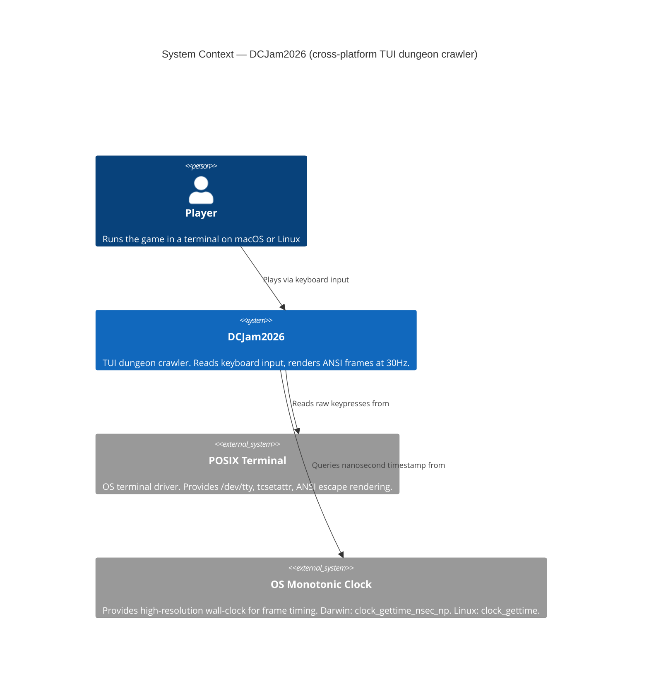
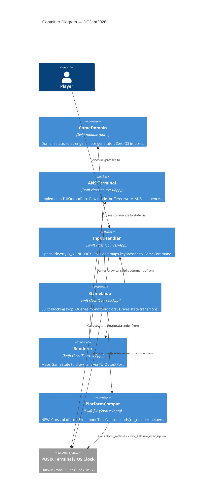

# Architecture Design — linux-port

**Feature**: linux-port
**Date**: 2026-04-03
**Author**: Morgan (Solution Architect — DESIGN wave)
**Status**: Ready for implementation

---

## 1. Problem Statement

The game executable (`DCJam2026`) currently only compiles on macOS because three files in `Sources/App/` contain `import Darwin`. Darwin is an Apple-platform-only system module. To reach the widest possible judge audience for Dungeon Crawler Jam 2026, the developer will:

1. **Ship pre-built Linux binaries** (ARM64 and AMD64) so judges do not need a Swift toolchain installed.
2. **Enable Linux source builds** in CI so the cross-platform correctness is continuously verified.

Linux judges play the pre-built binary. The Linux source build is a developer/CI concern. The fix must introduce zero functional regression, preserve Swift 6 language mode, and add no external dependencies.

---

## 2. Scope Analysis

### Affected Files

| File | Platform Dependency | Specific Issue |
|------|--------------------|-|
| `ANSITerminal.swift` | `import Darwin` | `termios`, `tcgetattr`, `tcsetattr`, `STDIN_FILENO`, `STDOUT_FILENO`, `TCSAFLUSH`, `ICANON`, `ECHO`, `ISIG`, `IXON`, `ICRNL`, `errno`, `EINTR`, hardcoded `c_cc.16` / `c_cc.17` tuple indices, `Darwin.write` |
| `InputHandler.swift` | `import Darwin` | `Darwin.open`, `Darwin.close`, `Darwin.read`, `O_RDONLY`, `O_NONBLOCK` |
| `GameLoop.swift` | `import Darwin` | `clock_gettime_nsec_np(CLOCK_MONOTONIC)` (Darwin-only), `usleep` |

### Unaffected Files

| File | Reason |
|------|--------|
| `Renderer.swift` | `import Foundation`; swift-corelibs-foundation ships with the Swift Linux toolchain |
| `GameDomain` (entire target) | Zero OS imports — pure Swift domain logic |
| `main.swift`, `TUIOutputPort.swift`, `DungeonFrameKey.swift`, `DungeonDepth.swift`, `DungeonFrames.swift` | No platform-specific imports |

### Root Cause Taxonomy

Three categories of divergence must be resolved:

1. **Module name divergence**: `import Darwin` (macOS) vs `import Glibc` (Linux). Most POSIX symbols exist in both modules under the same name.
2. **Darwin-only API**: `clock_gettime_nsec_np(CLOCK_MONOTONIC)` returns `UInt64` nanoseconds directly. Linux has no equivalent; Linux requires `clock_gettime(CLOCK_MONOTONIC, &timespec)` with a `timespec` struct.
3. **Struct layout divergence**: `termios.c_cc` is a fixed-size tuple in both platforms, but the `VMIN` and `VTIME` constant values differ: macOS VMIN=16/VTIME=17, Linux VMIN=6/VTIME=5. The current code hardcodes `.16` and `.17` tuple indices.

---

## 3. Proposed Solution — Option A: Per-File Conditional Imports + `PlatformCompat.swift` Shim

### Summary

- Add `#if canImport(Darwin) / #elseif canImport(Glibc) / #endif` to the three affected files in place of `import Darwin`.
- Add `Sources/App/PlatformCompat.swift` — a new file that encapsulates the two cases where a thin abstraction is needed:
  1. `monoTimeNanoseconds() -> UInt64` — wraps the two distinct monotonic-clock APIs behind a single call site.
  2. A documented pointer-based access pattern for `c_cc[VMIN]` and `c_cc[VTIME]` that compiles correctly on both platforms using the `VMIN`/`VTIME` constants (which are defined correctly in both Darwin and Glibc).

### Why This Is Correct

The `#if canImport` guard is the Swift-idiomatic mechanism for conditional OS imports. It resolves at compile time; no runtime overhead. All POSIX symbols needed in `ANSITerminal.swift` and `InputHandler.swift` (other than the clock API) exist identically in Darwin and Glibc, so the conditional import alone resolves those two files with minimal change. Only `GameLoop.swift` requires a call-site change (replacing `clock_gettime_nsec_np(...)` with `monoTimeNanoseconds()`), and only `ANSITerminal.swift` requires the `c_cc` index fix.

### Why Not Option B

Option B (dedicated `PlatformIO` protocol) would introduce a new protocol, at least two concrete implementations, and constructor injection plumbing — all to isolate a 3-file, 5-symbol divergence. The `TUIOutputPort` port already exists and provides the correct abstraction boundary for the renderer. A second platform-I/O protocol would add indirection without adding testability (the three affected symbols are already exercised indirectly through `ANSITerminal`, `InputHandler`, and `GameLoop`). Option B is appropriate when platform differences span multiple subsystems or when independent testing of platform variants is required. Neither condition applies here.

---

## 4. C4 System Context Diagram (L1)

---

## 5. C4 Container Diagram (L2)

---

## 6. Component Changes

### New Component: `Sources/App/PlatformCompat.swift`

Responsibility: isolate the two categories of cross-platform divergence that cannot be resolved by a bare conditional import alone.

Exported surface:
- `monoTimeNanoseconds() -> UInt64` — returns nanoseconds since an arbitrary monotonic origin. On Darwin: delegates to `clock_gettime_nsec_np(CLOCK_MONOTONIC)`. On Linux: calls `clock_gettime(CLOCK_MONOTONIC, &ts)` and combines `ts.tv_sec` and `ts.tv_nsec` into a `UInt64`.
- A documented approach for setting `c_cc[VMIN]` and `c_cc[VTIME]` using `withUnsafeMutablePointer(to: &raw.c_cc)` and the platform-provided `VMIN`/`VTIME` constants. This pattern avoids hardcoded tuple indices entirely.

The software crafter owns the internal structure; `PlatformCompat.swift` is the designated location for ALL current and future platform-specific abstractions in the `DCJam2026` target.

### Modified Component: `Sources/App/ANSITerminal.swift`

Changes required:
1. Replace `import Darwin` with `#if canImport(Darwin)` / `#elseif canImport(Glibc)` conditional.
2. Replace hardcoded `raw.c_cc.16 = 1` and `raw.c_cc.17 = 0` with the `withUnsafeMutablePointer` pattern using `VMIN` and `VTIME` constants from `PlatformCompat.swift`.
3. Replace `Darwin.write(...)` with the unqualified `write(...)` call (valid in both modules after conditional import).

No logic changes. No protocol changes. `TUIOutputPort` boundary is unaffected.

### Modified Component: `Sources/App/InputHandler.swift`

Changes required:
1. Replace `import Darwin` with `#if canImport(Darwin)` / `#elseif canImport(Glibc)` conditional.
2. Replace `Darwin.open(...)`, `Darwin.close(...)`, `Darwin.read(...)` with unqualified calls (valid in both modules).

No logic changes.

### Modified Component: `Sources/App/GameLoop.swift`

Changes required:
1. Replace `import Darwin` with `#if canImport(Darwin)` / `#elseif canImport(Glibc)` conditional.
2. Replace both `clock_gettime_nsec_np(CLOCK_MONOTONIC)` call sites with `monoTimeNanoseconds()` from `PlatformCompat.swift`.
3. `usleep` is available in both Darwin and Glibc — no change needed.

No logic changes. Frame timing semantics preserved.

### Unchanged: `Sources/GameDomain/` (entire target)

Zero modifications. The domain has no OS imports and requires no change.

---

## 7. Acceptance Criteria

**AC-1 — Linux build succeeds**
Given the repository is checked out on a Linux CI host with Swift 6.3 toolchain installed, when `swift build -c release` is executed for both `--arch aarch64` (ARM64) and `--arch x86_64` (AMD64), then each build completes with zero errors and zero warnings about unresolved identifiers. The resulting binaries are the artifacts shipped to judges.

**AC-2 — macOS build succeeds without regression**
Given the repository is checked out on a macOS host with Swift 6.3 toolchain installed, when `swift build` is executed, then the build completes with zero errors and the existing binary behaviour is unchanged.

**AC-3 — All tests pass on both platforms**
Given a full test run on macOS, when `swift test` is executed, then all 139 existing tests pass. The same test suite passes on Linux.

**AC-4 — No new dependencies introduced**
Given the `Package.swift` before and after the change, when the dependency graph is compared, then no new targets, products, or external packages have been added.

**AC-5 — GameDomain target is unmodified**
Given the diff of `Sources/GameDomain/`, the diff is empty.

**AC-6 — Frame timing is preserved**
Given the game running on Linux, when the game loop runs at 30Hz for 60 seconds, then no frames are dropped due to incorrect time calculations (elapsed time is non-negative and within expected bounds per frame).

---

## 8. Architecture Enforcement

Style: Hexagonal (existing — ports-and-adapters via `TUIOutputPort`)
Language: Swift
Tool: SwiftPM dependency graph (enforced by build system — no cross-module imports possible without declaration in `Package.swift`)

Rules to enforce:
- `GameDomain` target has zero imports from `Sources/App` (enforced structurally by SwiftPM — `GameDomain` has no `dependencies` entry)
- `PlatformCompat.swift` is the sole location for platform-conditional code (`#if canImport(Darwin)` / `#elseif canImport(Glibc)`) — enforce by code review convention and documented in `CLAUDE.md`
- No new `import Darwin` or `import Glibc` statements permitted outside `PlatformCompat.swift` after this change is merged — document as a project convention

Note: Swift does not have a dedicated architecture linting tool equivalent to ArchUnit or import-linter as of April 2026. SwiftPM's module boundary enforcement (which is a compile-time guarantee) covers the most critical rule (GameDomain isolation). Module-internal import conventions are documented in `docs/CLAUDE.md` and enforced by code review.
